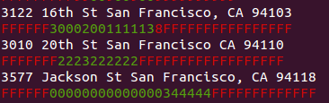

# Pelias Fuzzy Tester

[](https://greenkeeper.io/)

This is the Pelias fuzzy tester library, used for running our
[acceptance-tests](https://github.com/pelias/acceptance-tests) and
[fuzzy-tests](https://github.com/pelias/fuzzy-tests).

What are fuzzy tests? See the original [problem statement](https://github.com/pelias/acceptance-tests/issues/109)
that lead to the creation of this library.

Most importantly, fuzzy tests deliver more than just a single bit of pass or fail for each test:
they specify a total number of points (a score) for the test, and return how many points out of the
maximum were achieved. The weighting of individual parts of the test can be adjusted.

**Note:** fuzzy-tester requires NPM version 2 or greater. The NPM team
[recommends](http://blog.npmjs.org/post/85484771375/how-to-install-npm) you update NPM using NPM
itself with `sudo npm install -g npm`.
## Usage

```
// in the root directory of the repo containing the tests
fuzzy-tester
fuzzy-tester --help
fuzzy-tester -e prod
fuzzy-tester -t dev
```

## Test Case Files
Test-cases are expected to live in `test_cases/`, and are split into test
*suites* in individual JSON files. Each file must contain the following
properties:

 + `name` is the suite title displayed when executing.
 + `priorityThresh` indicates the expected result must be found within the top N locations. This can be set for the entire suite as well as overwritten in individual test cases.
 + `distanceThresh` (optional) defines the accepted maximal distance (in meters) between search result coordinates and the coordinates defined in each test.
    Each test case can include a specific threshold value. This makes sense because location of a neigborhood is not as accurately defined as location of,
    say, a building. Default threshold is 500 meters.
 + `tests` is an array of test cases that make up the suite.
 + `endpoint` the API endpoint (`search`, `reverse`, `suggest`) to target. Defaults to `search`.
 + `weights` (optional) test suite wide weighting for scores of the individual expectations. See the
   weights section below

`tests` consists of objects with the following properties:
 + `id` is a unique identifier within the test suite (this could be unnecessary, let's discuss)
 + `type` is simply a category to group the test under, to allowing running select groups of tests rather than all of
   them.
 + `status` is the optional expected status of this test-case (whether it should pass/fail/etc.), and will be used to
   identify improvements and regressions. May be either of `pass` or `fail`.
 + `user` is the name of the person that added the test case.
 + `endpoint` the API endpoint (`search`, `reverse`, `suggest`) to target. Defaults to `search`, which will override the
   `endpoint` specified by the test-suite.
 + `in` contains the API parameters that will be urlencoded and appended to the API url.
 + `expected` contains *expected* results. The object can contain a `priorityThresh` property, which will override the
   `priorityThresh` specified by the test-suite, and must contain a `properties` property. `properties` is mapped to an
   array of either of:

     + `object`: all of the key-value pairs will be tested against the objects returned by the API for exact matches.
     + `string`: a matching object will be looked up in the `locations.json` file. Allows you to easily reuse the same
      object for multiple test-cases.

   If `properties` is `null`, the test-case is assumed to be a placeholder.

   `expected` can also contain a test specific `distanceThresh` value, and an array of `[lon, lat]` coordinates.
   With these coordinates, it is possible to compare distance between locations found in the search and expected
   locations. This is often useful, because matching the name labels may fail even when the geocoder has found a
   proper result ('Harvard' != 'Harvard University'). Location coordinates are less ambiguous.

   Coordinate based tests also help to track invalid location data in the search database.

 + `unexpected` is analogous to `expected`, except that you *cannot* specify a `priorityThresh` and the `properties`
  array does *not* support strings.
 + `weights` (optional) test case specific weighting for scores of the individual expectations. See the
   weights section below

## Import Scripts for Test Cases

The `scripts` folder contains example scripts for creating fuzzy tests. For example, the data import script
`scripts/importHSLpoi.js` can be used to create a fuzzy test from a poi data list as follows:

 + Edit the import script `scripts/importHSLPoi.js` to specify which poi attributes and search attributes
   will be compared in the test. The current defaults serve as a good starting point.
 + Run the command `node scripts/importHSLPoi.js data/poi.txt`, where poi.txt is the source data file.
 + The script creates a test file called `HslPoitest.json`. You may edit it to fine tune the test setup.
   For example, you can change the threshold values afterwards, or add subtest specific thresholds.
 + Move the test file to the testing environment `../fuzzy-tests/test_cases` and run the test there.
   For more information, check [fuzzy-tests](http://github.com/Pelias/fuzzy-tests).

## Output Generators
The acceptance-tests support multiple different output generators, like an email and terminal output. See `node test
--help` for details on how to specify a generator besides the default. Note that the `email` generator requires an
AWS account, and that your `pelias-config` file contain the following configuration:

```javascript
{
	"acceptance-tests": {
		"email": {
			"ses": {
				"accessKeyId": "AWSACCESSKEY",
				"secretAccessKey": "AWS/Secret/key",
			},
			"recipients": ["recipient1@domain.com", "recipient2@domain.com"], // the list of recipients
		}
	}
}
```

### Autocomplete mode

A special output generator, `-o autocomplete` not only changes the output, but changes the behaviour of the test suite.
Instead of running each test case exactly as defined, it will run many tests for each test case. The tests will be run
against the autocomplete endpoint and will correspond to successively longer substrings of the input text, similar to
how a user would type the text into autocomplete. It looks like this:



The results are shown underneath the input text, with each character corresponding to the result of the autocomplete
query with the input text up to the character above entered. Tests that pass are green, tests that fail are red. If the
expected output was not found at all, the result character will be an `F`, if the expected output was found, the
character will be the zero indexed location in the API results where it was found.

To the right of the input text, some additional info might be displayed. The first is any additional parameters being
sent with the API call, like a location bias. The second is a count of the number of expectations included in the test
case. This helps detect situations where one expectation is found, but the other isn't (the result might be a confusing
red `0` in that case).

## API URL aliases
The acceptance-tests runner recognizes a number of aliases for Pelias API URLs (eg, `stage` corresponds to
`pelias.stage.mapzen.com`), which can be specified as command-line arguments when running a test suite. You can
override the default aliases and define your own in `pelias-config`:

```javascript
{
	"acceptance-tests": {
		"endpoints": {
			"alias": "http://my.pelias.instance"
		}
	}
}
```

## Weights

Weights are used to influence the score each individual expectation contributes to the total score
for a test. By default, all fields in expected properties, passing the priority threshold, and the
absence of any unexpected properties each contribute one point.

Any score for any individual property can be changed by specifying an object `weights` in a test
suite, or in an individual test case. For example, to more heavily weight the `name` property by
giving it a weight of 10 points, set weights to the following:
```javascript
{
  "properties": {
    "name": 10
  }
}
```

Weights can be nested and are completely optional, in which case the defaults will be in effect.

## Using the Docker image

### rebuild the image

you can rebuild the image on any system with the following command:

```bash
$ docker build -t pelias/fuzzy-tester .
```

### download pre-built image

Up to date Docker images are built and automatically pushed to Docker Hub from our continuous integration pipeline

You can pull the latest stable image with

```bash
$ docker pull pelias/fuzzy-tester
```

### running tests in a container

You can bind-mount local tests to make them available inside the container using the `-v` flag.

In this example, the local file `./pelias.json` and local directory `./test_cases` are bind-mounted in to the container.

```bash
docker run --rm -i \
  -v './pelias.json:/code/pelias.json' \
  -v './test_cases:/code/pelias/fuzzy-tester/test_cases' \
  pelias/fuzzy-tester --help
```

### download custom image tags

We publish each commit and the latest of each branch to separate tags

A list of all available tags to download can be found at https://hub.docker.com/r/pelias/fuzzy-tester/tags/
